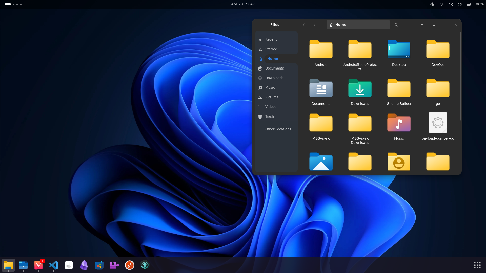

<br>

<div id="header" align="center">
    
</div>

<br>

<div align="center">
  
  
</div>

<br>

## 📝 Summary
**A transformative tool designed for Penetration Testers, Red-Teamers, and general Linux enthusiasts who need to mask their tooling environment, or simply crave the familiarity of the Windows interface.** 

This project is your secret agent, seamlessly morphing your Linux desktop to mirror the look and feel of a typical Windows environment. It's perfect for those who want to blend in with the Windows crowd, while still benefitting from the power and flexibility of a Linux-based system! 

**Experience the best of both worlds with Nix Incognito!**

<br>

> Shoutout to **Kali Linux** and **Offensive Security** for their outstanding work creating the *Kali Undercover* utility for XFCE desktops
>
> This project was inspired by that amazing tool!

<br>

## 💫 Features

- Quickly switch between your normal Linux desktop and a Windows-themed alternative
- Easily back up and restore your current GNOME configuration 
- Specify different icons, themes, and wallpaper to be used by the tool

  ### Built With:
  <div>
    &nbsp;
    &nbsp;
    &nbsp;
    &nbsp;
    &nbsp;
  </div>
  ━━━━━━━━━━━━━━━━━━━━━━━━━━━━

<br>

<div align="center">
  
</div>

<br>

## 🛠️ Installation Options

**If you want to make any adjustments to the code, or simply build the standalone executable on your device, you can do the following:**

```shell
# Download repository 
git clone https://github.com/dedsyn4ps3/nix-incognito.git && cd nix-incognito

# OPTION 1 - Build application using Nix Flakes
nix build --impure

# OPTION 2 - Build using the standard derivation
nix-build
```

<br>

> **NOTE:**
>
> Be aware that the **`cargoSha256`** hash may be different between commits!
>
> If you receive a build error when using **`nix build`**, simply replace the hash with the
> `got:` value that is returned by the hash mismatch error, then re-build.

<br>

**While the tool can be built and run on its own from the `result` directory created by running either of the above `nix*` commands, the best way to incorporate the utility into your system is to import it into your `configuration.nix`.** 

Once imported, a mere `nixos-rebuild switch` is all it takes to make it available from your system's `$PATH`.

<br>

**Installing the tool using the recommended method can be accomplished by doing the following:**

- Create a package file in the same directory as your `configuration.nix` file (or wherever you may have your system modules organized)
- Copy the contents of `package.nix` into that empty file
- Import the package into your primary configuration

**Let's say, for example, you create an empty file in your configuration directory called `nix-incognito.nix`...your config folder may look something like this:**

```
├── hardware-configuration.nix
├── configuration.nix
└── modules
    ├── incognito.nix
```

<br>

**To install the utility and make it available to your `$PATH`, all that's left to do is add it to your module imports inside of `configuration.nix`!**

> **IMPORTANT:**
>
> Be sure to include the `pathsToLink` declaration as well in your configuration! This allows the tool to access the filepaths of the background
> wallpapers, icons, and theme that get installed during the building of the `nix-incognito` package...

<br>

```nix
...

  nix = {
      package = pkgs.nixFlakes;
      extraOptions = ''
        experimental-features = nix-command flakes
      '';
  };

  environment.systemPackages = with pkgs; [
     vim
     git
     (import ./modules/incognito.nix)
  ];


  #######################################################################
  #         The path link declaration below is VERY IMPORTANT!          #
  #    Make sure to include it in your config in order for the newly    #
  #    installed theme and icons to be made available to the tool...    #
  #######################################################################

  environment.pathsToLink = [
    "/share/backgrounds"
    "/share/icons"
    "/share/themes"
  ];

...
```

<br>

## 🕹️ Usage

Using the tool is extremely straightforward and easy. Simply invoke the tool from a commandline shell to enable `incognito` mode using the tool's defaults:

```bash
#  Invoke utility with defaults
$  nix-incognito
```

By default, the tool will run in a **verbose** mode and display output as it backs up your current **`GNOME`** configuration and makes the necessary changes to your desktop. This output can be supressed by passing the **`-s`** or **`--silent`** flag to the tool when invoking it from your shell.

**Additional options are available to use as well:**
  - **`-t`** or **`--theme`** to apply a different global theme instead of the default
  - **`-i`** or **`--icons`** to use a different icon theme
  - **`-w`** or **`--wallpaper`** to apply a different desktop wallpaper

<br>

> **NOTE:** 
> 
> The use of any alternate icons or themes will only work if they're already installed on your machine!
> 
> **This tool's repo contains the default icon and theme set used by the utility, which get installed along with the tool itself...**

<br>

```bash
# Enable Nix-Incognito using different theme and icons
$ nix-incognito -t "Orchis-Dark" -i "Tela-Circle-Dark"

# Run tool silently and use a different wallpaper
$ nix-incognito --silent -w "/path/to/wallpaper.jpg"
```

<br>

<div align="center">
  
  <br>
  <br>
  <br>
  &nbsp;
  <br>
  <br>
  <br>
  
</div>


<br>

## 🤝 Contributing

This repo started off as a personal side-project for my own use, but quickly developed into an even larger concept. I felt like this would be a great opportunity to not only expand my own knowledge building with **`nix`** , but also a way for other Pentesters and Security-focused developers using **`NixOS`** to have a tool available to them to alter their desktops when it suits them...just like how **Kali Linux** users are able to do on their XFCE desktops!

This tool is still in its infancy, and while I plan to continue adding more features down the road, I'm only able to test and commit changes so often. If there are any **`NixOS`**, **`Rust`**, or **`KDE`** afficianados out there looking to help this project grow by contributing various ideas or features...**I'd be more than happy to work with you and take a look at any recommendations or ideas you may have!**

<br>

## 📜 License
> Copyright (C) 2024  Ed Rutherford (dedsyn4ps3)
>
> This program is free software: you can redistribute it and/or modify
> it under the terms of the GNU General Public License as published by
> the Free Software Foundation, either version 3 of the License, or
> (at your option) any later version.
> 
> This program is distributed in the hope that it will be useful,
> but WITHOUT ANY WARRANTY; without even the implied warranty of
> MERCHANTABILITY or FITNESS FOR A PARTICULAR PURPOSE.  See the
> GNU General Public License for more details.
> 

<br>

**See `LICENSE.md` for additional license info**
